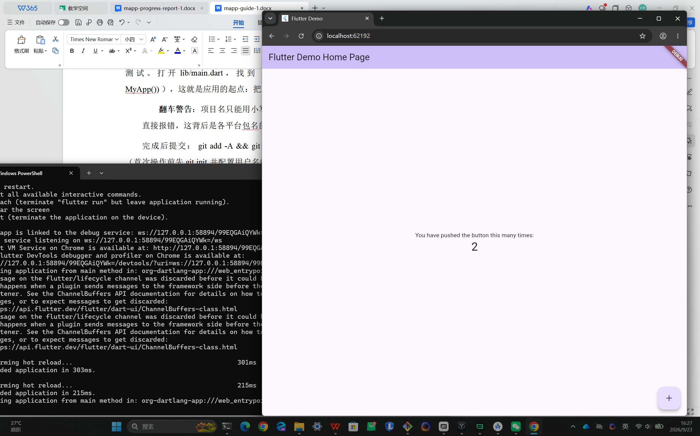
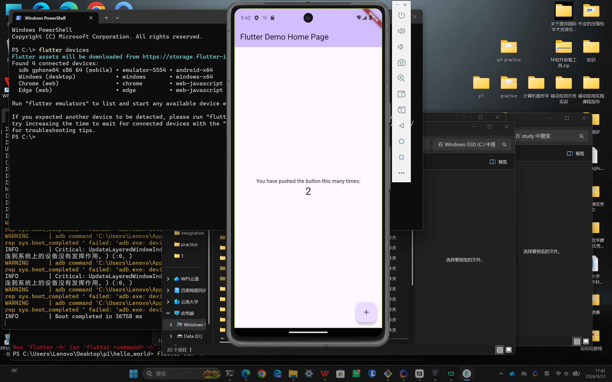

# hello_world

本课程第一个 Flutter 应用课堂案例复现项目。基于 `flutter create hello_world` 生成的计数器示例，在 Web 端与 Android 模拟器两端运行验证。

## 运行方式

先在本项目根目录执行依赖拉取：

```bash
flutter pub get
```

查看当前可用运行目标（会列出 Chrome、Edge、Windows、已连接的模拟器等）：

```bash
flutter devices
```

### Web 端

```bash
flutter run -d chrome
```

浏览器会自动打开，看到计数器示例即成功。运行后终端进入交互模式：按 `r` 热重载、`R` 热重启、`q` 退出。

### Android 模拟器

1. 打开 Android Studio → Device Manager，创建并启动一台模拟器（本项目使用 Pixel 7，系统镜像 API 34 / x86_64）。
2. 用 `flutter devices` 查看模拟器 ID（如 `emulator-5554`）。
3. 在项目根目录执行：

```bash
flutter run -d emulator-5554
```

## 两端运行截图

### Web 端运行



### Android 模拟器运行


